# 一、C++基础知识

## 1. 程序的注释
    1. 单行注释使用符号``//``

    2. 多行注释使用符号``/**/``

## 2. 常量
    1. ``#define 常量名 常量值``

    2. ``const 数据类型 常量名 = 常量值``

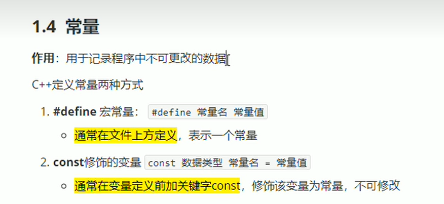

## 3. 标识符的命名规则
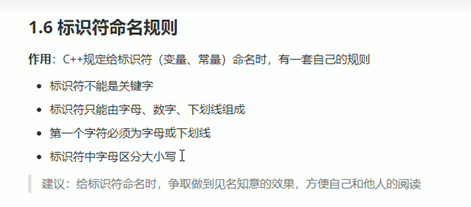

# 二、数据类型

## 1. 整型
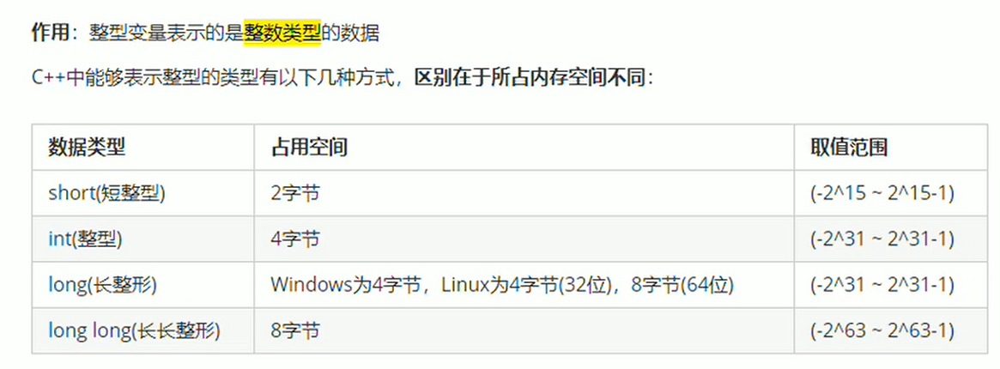

## 2. sizeof关键字
统计所有类型所占内存大小

## 3. 实型（浮点型）
    1. 单精度float
    2. 双精度double
| 数据类型 | 占用空间 | 有效位数 |
|:--------:|:---------:|:-------:|
| float | 4 | 7位有效数字|
| double | 8 | 15-16位有效数字 |

## 4. 字符型
    1. 作用：字符型变量用于显示单个字符
    2. 语法：char ch = 'a';

## 5. 转义字符
常用的有：``\n \\ \t``
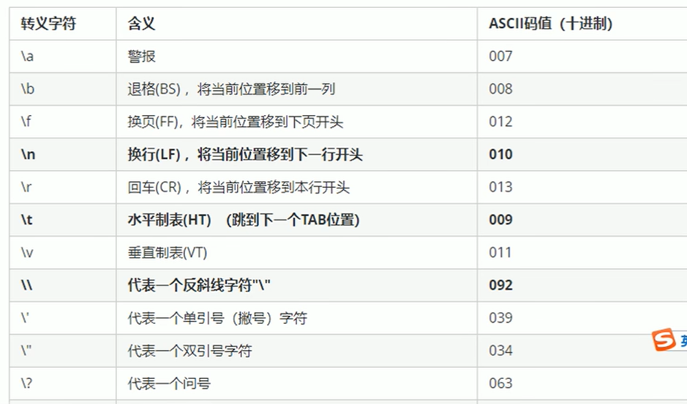

## 6. 字符串
c风格字符串:``char 变量名[] = "字符串值"``

c++风格字符串:``string 变量名 = "字符串值"``

## 7. 布尔类型值bool

## 8.数据的输入
    1. 关键字：cin
    2. 语法：cin >> 变量

# 运算符

## 1. 算数运算符

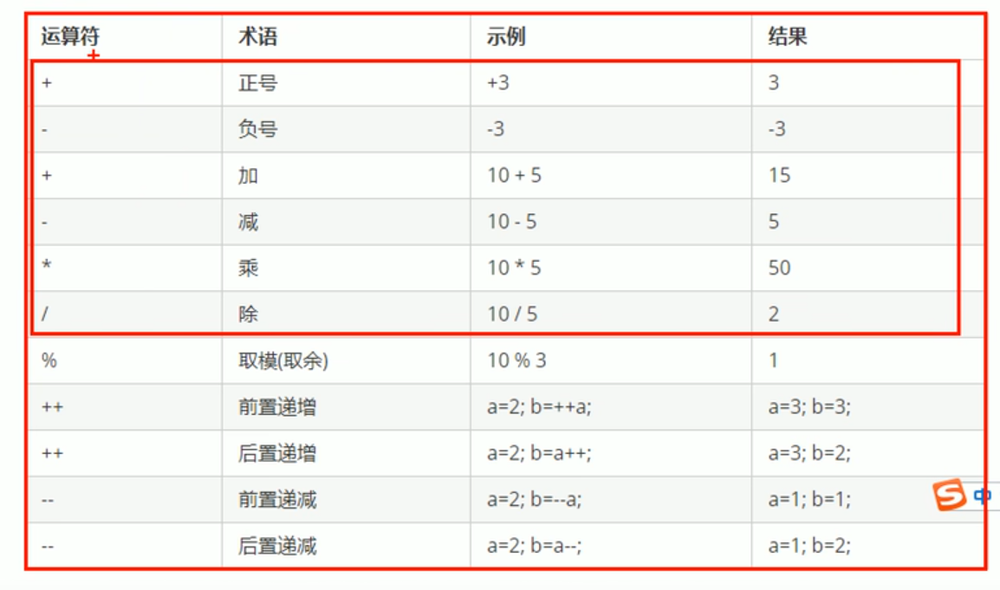
前置递增，++a先加1再参与表达式运算
后置递增，a++先参与表达式计算再加1

## 2. 逻辑运算符
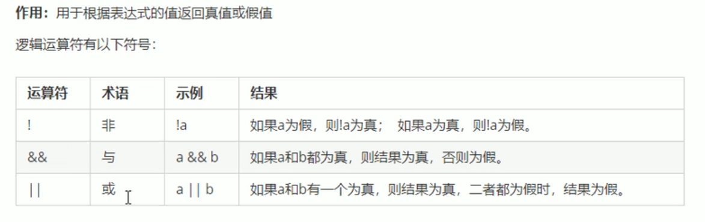

# 三、程序流程结构

## 1. 选择结构
    1. 三目运算符：语法：``表达式1 ？ 表达式2 ：表达式3``

        表达式1为真运行表达式2

        表达式1为假运行表达式3

    2. switch语句：表达式类型只能是整形或者字符型

## 2. 循环结构

## 3. 跳转语句
    1. goto语句：
        语法：goto 标记

# 四、数组

## 1. 一维数组

一维数组名的用途：

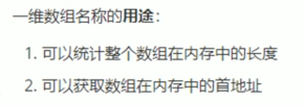

## 2. 冒泡排序

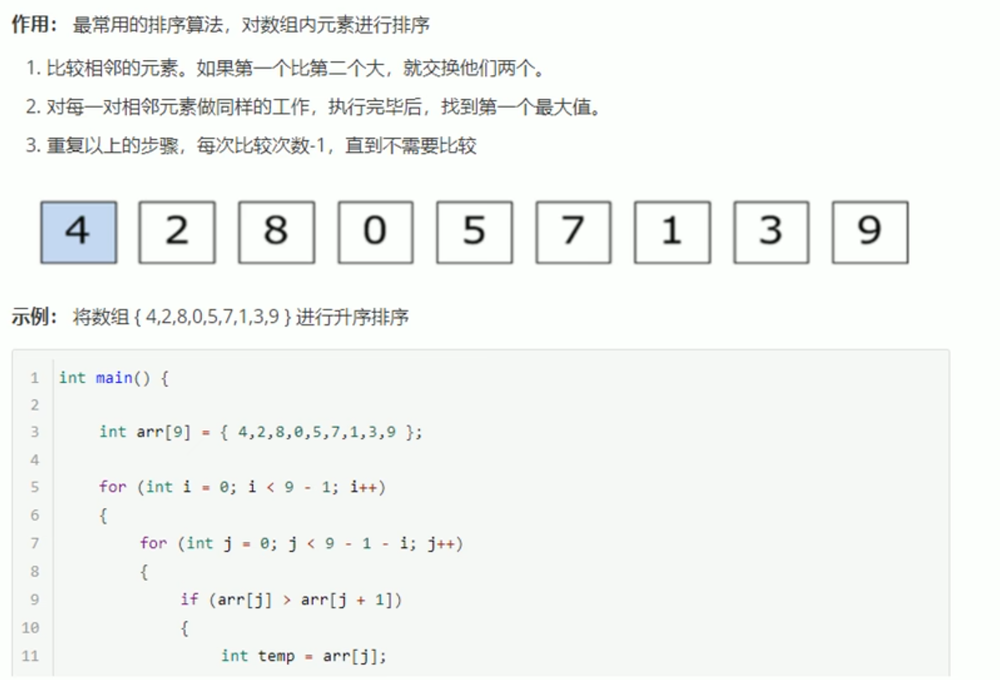

# 五、函数

1. 定义

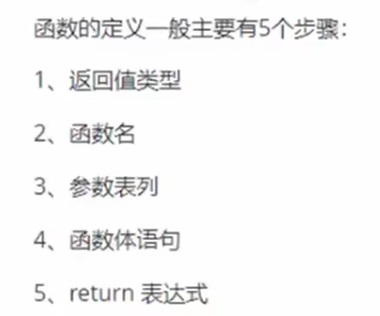

2. 语法
```

返回值类型 函数名 （参数列表）
{

    函数体语句

    return表达式
}

```

3. 函数的声明

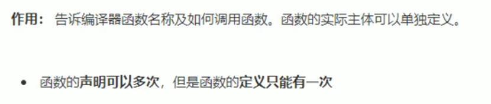

4. 函数的分文件编写

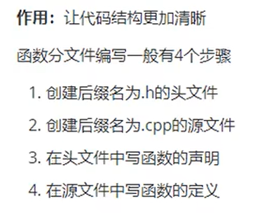

# 六、指针

1. 基本概念
   1. 作用：间接访问内存
   2. 内存编号从0开始记录，一般为16进制表示
   3. 可以利用指针变量保存地址

语法：``数据类型 * 变量名;``

2. 空指针和野指针
   1. 空指针：
      1. 用于给指针变量初始化
      2. 空指针是不可以进行访问的
   2. 野指针：指针变量指向非法的内存空间

3. 常量指针和指针常量
   1. 常量指针：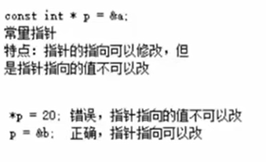
   2. 指针常量： 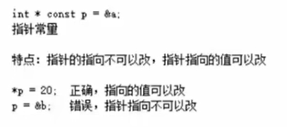

# 七 结构体

1. 结构体是用户自定义的数据类型，允许用户存储不同的数据类型

2. 结构体的定义和使用：
   1. 语法：``struct 结构体名 {结构体成员列表};``
   2. 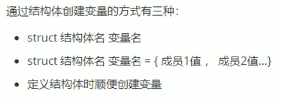

        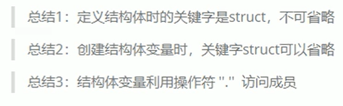

3. 结构体数组
   1. 作用：将自定义的结构体放入到数组中方便维护
   2. 语法：``struct 结构体名 数组名[元素个数] = {{}，{}，{}}; ``

4. 结构体指针
   
   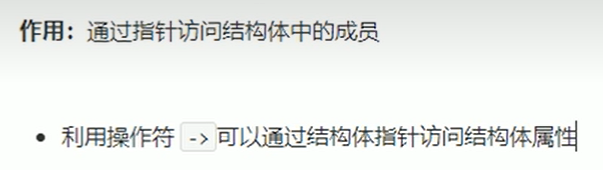


# C++核心编程

# 1. 内存分模型
- 代码区：存放函数的二进制代码，由操作系统进行管理
- 全局区：存放全局变量和静态变量以及常量
- 栈区：由编译器自动分配释放，存放函数的参数值、局部变量等
- 堆区：由程序员进行分配和释放，若程序员不释放，程序结束时由操作系统回收

## 1.1 程序运行前

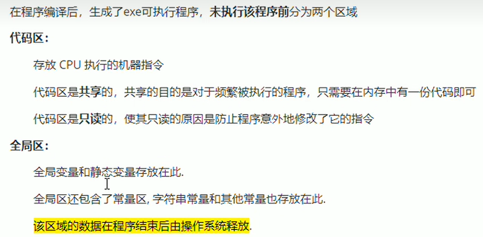

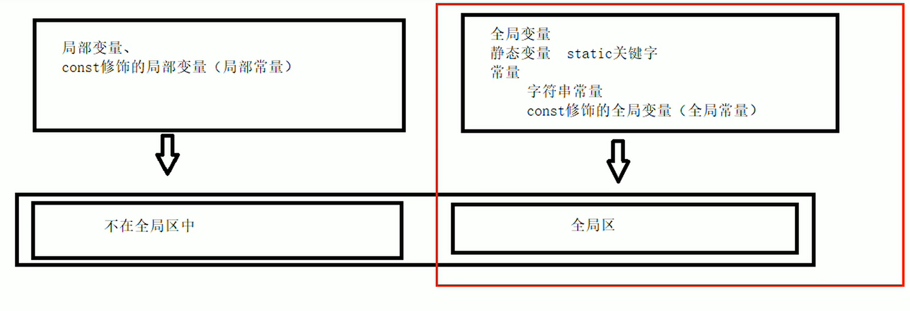

- C++在程序运行前分为全局区和代码区
- 代码区特点是只读和共享
- 全局区中存放全局变量、静态变量和常量
- 常量区中存放 const修饰的全局常量 和 字符串常量

## 1.2 程序运行后

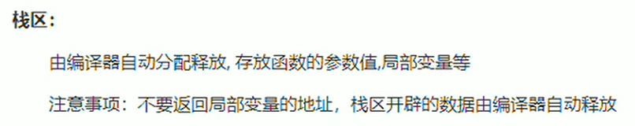

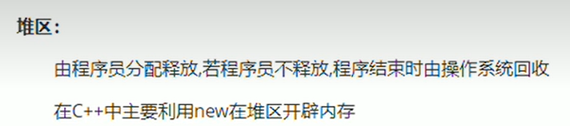

## 1.3 new操作符

C++中利用new操作符在堆区开辟数据

语法：``new 数据类型``

利用new创建的数据，会返回数据对应的类型的指针

释放堆区数据用delete，数据类型为数组时用delete[]

# 2. 引用

## 2.1 引用的基本使用：
作用：给变量起别名

语法：``数据类型 &别名 = 原名``

## 2.2 注意事项

引用必须初始化

引用在初始化后不可改变

## 2.3 引用做函数参数

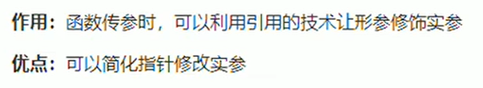

## 2.4 引用做函数返回值

- 作用：引用可以作为函数的返回值存在

- 注意：不要返回局部变量的引用

- 用法：函数调用作为左值

## 2.5 引用的本质

引用的本质在C++内部是一个指针常量

例如：``int& ref = &a``

//自动转换为``int* const ref = &a``，指针常量是指针指向不可以改，也说明为什么引用不可更改

## 2.6 常量引用

- 作用：常量引用主要用来修饰形参，防止误操作
- 在函数参数列表中，可以加const修饰形参，防止形参改变实参


# 3. 函数提高

## 3.1 函数默认参数

注意事项：
- 如果某个位置已经有默认参数，这个位置往后从左到右都必须有默认值

- 如果函数声明有默认参数，函数实现就不能有默认参数（声明和实现只能有一个有默认参数）

## 3.2 函数占位参数
 
 语法：``返回值类型 函数名 （数据类型）{}``

 占位也可以有默认参数

 ## 3.3 函数重载

### 3.3.1 概述

函数重载的满足条件：
- 同一个作用域
- 函数名称相同
- 函数类型不同，或者个数不同，或者顺序不同

注意事项：
- 函数的返回值不可以作为函数重载的条件
```
例如：
void func(){}

int func(){}

```

- 引用作为重载函数

- 函数重载碰到默认参数


# 4 类和对象
C++面向对象的三大特性为：``封装、继承和多态``

C++认为万事万物皆为对象，对象上有其属性和行为

## 4.1 封装

### 4.1.1 封装的意义
- 将属性和行为作为一个整体，表现生活中的事物
- 将属性和行为加以权限控制

语法：``class 类名{  访问权限： 属性 / 行为 }；``

```
class Circle
{
	//访问权限
public:
	//属性(半径)
	int m_r;
	//行为
	double caculateZC()
	{
		return 2 * PI * m_r;
	}
};

int main() {

	//创建圆类的对象，实例化
	Circle c1;

	//属性
	c1.m_r = 10;

	//行为
	double ZC = c1.caculateZC();
	cout << "圆的周长为：" << ZC << endl;
    
    system("pause");
	return 0;
}
```

封装的意义二：
- 类在设计时可以把属性和行为放在不同的权限下，加以控制

访问的权限有三种：

| 访问权限 | 解释 | 特点 | 区别 |
| :-----: | :-----: | :-----: | :-----: |
| public | 公共权限 | 类内可以访问，类外也可以访问 |
| protected | 保护权限 | 类内可以访问，类外不可以访问 | 子类可以访问父类中的保护内容 |
| private | 私有权限 | 类内可以访问，类外不可以访问 |子类不可以访问父类中的保护内容 |

### 4.1.2 struct和class的区别
默认的访问权限不同
- struct的默认访问权限为共有
- class的默认权限为私有

### 4.1.3 成员属性设置为私有

优点1：将所有的成员属性设置为私有，可以自己控制读写权限

优点2：对于写权限，可以检测数据的有效性


## 4.2 对象的初始化和清理

### 4.2.1 构造函数和析构函数
对象的初始化和清理

- 构造函数：主要作用在于创建对象时为对象的成员属性赋值，构造函数由编译器自动调用，无需手动调用
- 析构函数：主要作用在于对象销毁前系统自己调用，执行一些清理工作

构造函数语法：``类名(){}``
1. 构造函数，没有返回值也不写void
2. 函数名称与类名相同
3. 构造函数可以有参数，因此可以发生重载
4. 程序在调用对象的时候会自动调用构造，无需手动调用，而且只会调用一次

析构函数语法：``~类名(){}``
1. 析构函数，没有返回值也不写void
2. 函数名称与类名相同，在名称前加上符号~
3. 析构函数不可以有参数，因此不可以发生重载
4. 程序在调用对象的时候会自动调用析构，无需手动调用，而且只会调用一次