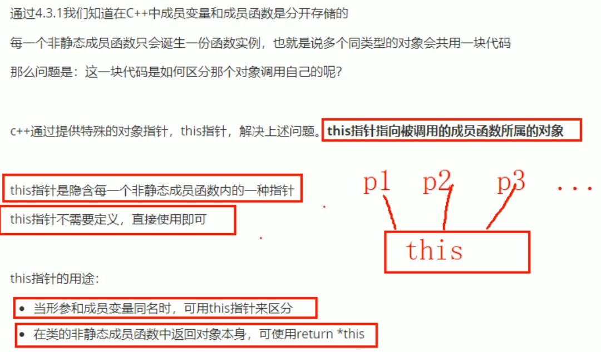
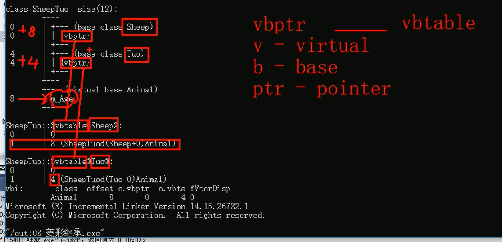
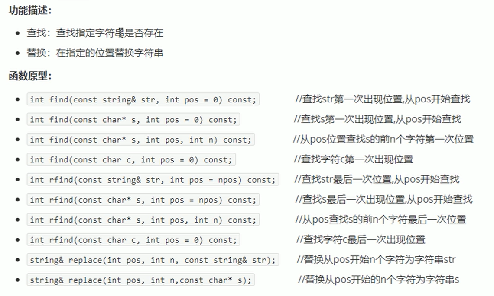
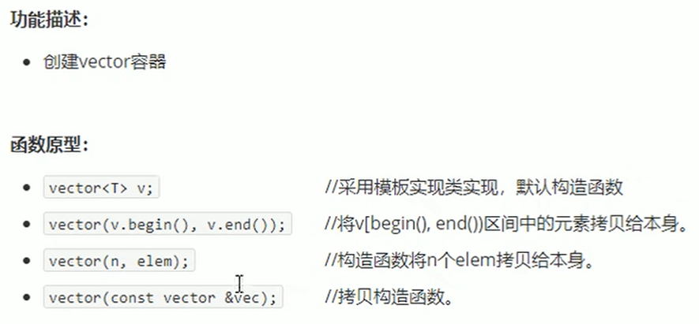
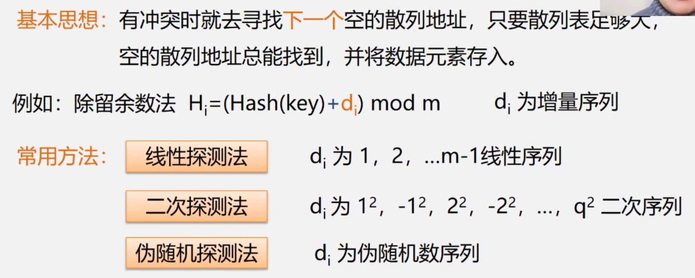
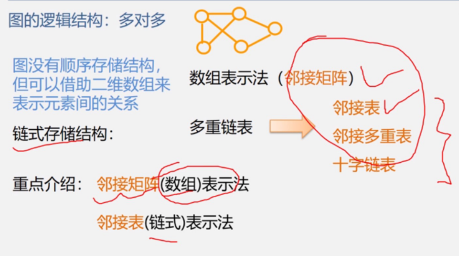
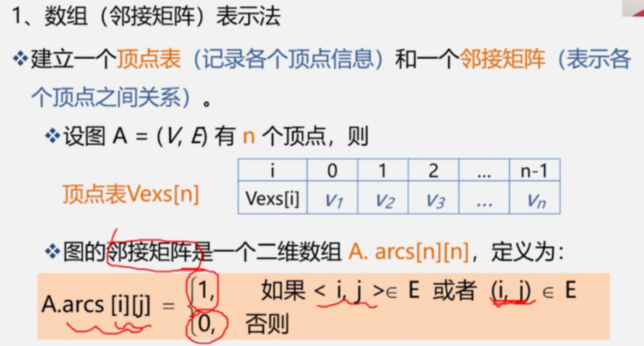
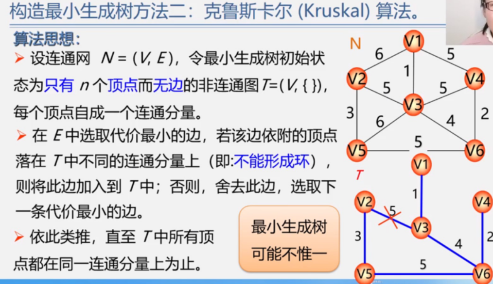

# 一、C++基础知识

## 1. 程序的注释
    1. 单行注释使用符号``//``

    2. 多行注释使用符号``/**/``

## 2. 常量
    1. ``#define 常量名 常量值``

    2. ``const 数据类型 常量名 = 常量值``


## 3. 标识符的命名规则


# 二、数据类型

## 1. 整型


## 2. sizeof关键字
统计所有类型所占内存大小

## 3. 实型（浮点型）
    1. 单精度float
    2. 双精度double
| 数据类型 | 占用空间 | 有效位数 |
|:--------:|:---------:|:-------:|
| float | 4 | 7位有效数字|
| double | 8 | 15-16位有效数字 |

## 4. 字符型
    1. 作用：字符型变量用于显示单个字符
    2. 语法：char ch = 'a';

## 5. 转义字符
常用的有：``\n \\ \t``


## 6. 字符串
c风格字符串:``char 变量名[] = "字符串值"``

c++风格字符串:``string 变量名 = "字符串值"``

## 7. 布尔类型值bool

## 8.数据的输入
    1. 关键字：cin
    2. 语法：cin >> 变量

# 运算符

## 1. 算数运算符


前置递增，++a先加1再参与表达式运算
后置递增，a++先参与表达式计算再加1

## 2. 逻辑运算符


# 三、程序流程结构

## 1. 选择结构
    1. 三目运算符：语法：``表达式1 ？ 表达式2 ：表达式3``

        表达式1为真运行表达式2

        表达式1为假运行表达式3

    2. switch语句：表达式类型只能是整形或者字符型

## 2. 循环结构

## 3. 跳转语句
    1. goto语句：
        语法：goto 标记

# 四、数组

## 1. 一维数组

一维数组名的用途：


## 2. 冒泡排序


# 五、函数

1. 定义


2. 语法
```

返回值类型 函数名 （参数列表）
{

    函数体语句

    return表达式
}

```

3. 函数的声明


4. 函数的分文件编写


# 六、指针

1. 基本概念
   1. 作用：间接访问内存
   2. 内存编号从0开始记录，一般为16进制表示
   3. 可以利用指针变量保存地址

语法：``数据类型 * 变量名;``

2. 空指针和野指针
   1. 空指针：
      1. 用于给指针变量初始化
      2. 空指针是不可以进行访问的
   2. 野指针：指针变量指向非法的内存空间

3. 常量指针和指针常量
   1. 常量指针
   
   2. 指针常量
   

# 七 结构体

1. 结构体是用户自定义的数据类型，允许用户存储不同的数据类型

2. 结构体的定义和使用：
   1. 语法：``struct 结构体名 {结构体成员列表};``
   2. 
   

    

3. 结构体数组
   1. 作用：将自定义的结构体放入到数组中方便维护
   2. 语法：``struct 结构体名 数组名[元素个数] = {{}，{}，{}}; ``

4. 结构体指针
   
   


# C++核心编程

# 1. 内存分模型
- 代码区：存放函数的二进制代码，由操作系统进行管理
- 全局区：存放全局变量和静态变量以及常量
- 栈区：由编译器自动分配释放，存放函数的参数值、局部变量等
- 堆区：由程序员进行分配和释放，若程序员不释放，程序结束时由操作系统回收

## 1.1 程序运行前


- C++在程序运行前分为全局区和代码区
- 代码区特点是只读和共享
- 全局区中存放全局变量、静态变量和常量
- 常量区中存放 const修饰的全局常量 和 字符串常量

## 1.2 程序运行后


## 1.3 new操作符

C++中利用new操作符在堆区开辟数据

语法：``new 数据类型``

利用new创建的数据，会返回数据对应的类型的指针

释放堆区数据用delete，数据类型为数组时用delete[]

# 2. 引用

## 2.1 引用的基本使用：
作用：给变量起别名

语法：``数据类型 &别名 = 原名``

## 2.2 注意事项

引用必须初始化

引用在初始化后不可改变

## 2.3 引用做函数参数


## 2.4 引用做函数返回值

- 作用：引用可以作为函数的返回值存在

- 注意：不要返回局部变量的引用

- 用法：函数调用作为左值

## 2.5 引用的本质

引用的本质在C++内部是一个指针常量

例如：``int& ref = &a``

//自动转换为``int* const ref = &a``，指针常量是指针指向不可以改，也说明为什么引用不可更改

## 2.6 常量引用

- 作用：常量引用主要用来修饰形参，防止误操作
- 在函数参数列表中，可以加const修饰形参，防止形参改变实参


# 3. 函数提高

## 3.1 函数默认参数

注意事项：
- 如果某个位置已经有默认参数，这个位置往后从左到右都必须有默认值

- 如果函数声明有默认参数，函数实现就不能有默认参数（声明和实现只能有一个有默认参数）

## 3.2 函数占位参数
 
 语法：``返回值类型 函数名 （数据类型）{}``

 占位也可以有默认参数

 ## 3.3 函数重载

### 3.3.1 概述

函数重载的满足条件：
- 同一个作用域
- 函数名称相同
- 函数类型不同，或者个数不同，或者顺序不同

注意事项：
- 函数的返回值不可以作为函数重载的条件
```
例如：
void func(){}

int func(){}

```

- 引用作为重载函数

- 函数重载碰到默认参数


# 4 类和对象
C++面向对象的三大特性为：``封装、继承和多态``

C++认为万事万物皆为对象，对象上有其属性和行为

## 4.1 封装

### 4.1.1 封装的意义
- 将属性和行为作为一个整体，表现生活中的事物
- 将属性和行为加以权限控制

语法：``class 类名{  访问权限： 属性 / 行为 }；``

```
class Circle
{
	//访问权限
public:
	//属性(半径)
	int m_r;
	//行为
	double caculateZC()
	{
		return 2 * PI * m_r;
	}
};

int main() {

	//创建圆类的对象，实例化
	Circle c1;

	//属性
	c1.m_r = 10;

	//行为
	double ZC = c1.caculateZC();
	cout << "圆的周长为：" << ZC << endl;
    
    system("pause");
	return 0;
}
```

封装的意义二：
- 类在设计时可以把属性和行为放在不同的权限下，加以控制

访问的权限有三种：

| 访问权限 | 解释 | 特点 | 区别 |
| :-----: | :-----: | :-----: | :-----: |
| public | 公共权限 | 类内可以访问，类外也可以访问 |
| protected | 保护权限 | 类内可以访问，类外不可以访问 | 子类可以访问父类中的保护内容 |
| private | 私有权限 | 类内可以访问，类外不可以访问 |子类不可以访问父类中的保护内容 |

### 4.1.2 struct和class的区别
默认的访问权限不同
- struct的默认访问权限为共有
- class的默认权限为私有

### 4.1.3 成员属性设置为私有

优点1：将所有的成员属性设置为私有，可以自己控制读写权限

优点2：对于写权限，可以检测数据的有效性


## 4.2 对象的初始化和清理

### 4.2.1 构造函数和析构函数
对象的初始化和清理

- 构造函数：主要作用在于创建对象时为对象的成员属性赋值，构造函数由编译器自动调用，无需手动调用
- 析构函数：主要作用在于对象销毁前系统自己调用，执行一些清理工作

构造函数语法：``类名(){}``
1. 构造函数，没有返回值也不写void
2. 函数名称与类名相同
3. 构造函数可以有参数，因此可以发生重载
4. 程序在调用对象的时候会自动调用构造，无需手动调用，而且只会调用一次

析构函数语法：``~类名(){}``
1. 析构函数，没有返回值也不写void
2. 函数名称与类名相同，在名称前加上符号~
3. 析构函数不可以有参数，因此不可以发生重载
4. 程序在调用对象的时候会自动调用析构，无需手动调用，而且只会调用一次

### 4.2.2 构造函数的分类及调用
两种分类方式：
- 按参数分为：有参构造和无参构造
- 按类型分为：普通构造和拷贝构造

三种调用方式：
- 括号法
- 显示法
- 隐式转换法

```
#include<iostream>;
using namespace std;

//分类
//按照参数分类  无参构造（默认构造）和有参构造
//按照类型分类  普通构造   拷贝构造
class Person
{
public:
	//构造函数
	Person()
	{
		cout << "person 的无参构造函数调用" << endl;
	}
	Person(int a)
	{
		age = a;
		cout << "person 的有参构造函数调用" << endl;
	}
	//拷贝构造函数
	Person(const Person &p)
	{
		//将传入人身上的属性，拷贝到当前对象身上
		age = p.age;
		cout << "person 的拷贝构造函数调用" << endl;
	}


	//析构函数
	~Person()
	{
		cout << "person 的析构函数调用" << endl;
	}

	int age;
};

void test()
{
	//1.括号法
	Person p1;//默认构造法
	Person p2(18);//有参构造法
	Person p3(p2);//拷贝造法

	//注意事项1
	//Person p1();程序会认为是函数声明，不会认为在创建对象


	//2.显示法
	Person p1;
	Person p2 = Person(18);//有参构造
	Person P3 = Person(p2);//拷贝构造

	//Person(10);//匿名对象，当前执行结束后，系统会立即回收掉匿名对象

	//注意事项2
	//不要用拷贝构造函数初始化匿名对象，编译器会认为Person (p3) == Person p3;(对象声明)

	//3.隐式括号法
	Person p4 = 10;//有参构造  相当于写了Person p4 = Person(10);
	Person p5 = p4;//拷贝构造
}

int main()
{
	test();

	system("pause");
	return 0;
}

```

### 4.2.3 拷贝构造函数的调用时机

- 使用一个已经创建完毕的对象来初始化一个新对象
- 值传递的方式给函数参数传值
- 以值方式返回局部变量

```
#include<iostream>;
using namespace std;

class Person
{
public:
	Person()
	{
		cout << "Person的默认构造函数调用" << endl;
	}
	Person(int age)
	{
		m_age = age;
		cout << "Person的有参构造函数调用" << endl;
	}
	Person(const Person &p)
	{
		m_age = p.m_age;
		cout << "Person的拷贝构造函数调用" << endl;
	}

	~Person()
	{
		cout << "Person的析构函数调用" << endl;
	}

	int m_age;
};

//已创建完毕的对象初始化另一个对象
void test01()
{
	Person p1;
	Person p2(p1);
}
//值传递的方式给函数参数传值
void dowork(Person p)
{

}

void test02()
{
	Person p;
	dowork(p);
}
//以值方式返回局部变量(这里未调用拷贝函数的原因：返回值优化)

Person dowork2()
{
	Person p1;
	cout << "p1的地址为：" << (int*) & p1 << endl;
	return p1;
}
void test03()
{
	Person p = dowork2();
	cout << "p的地址为：" << (int*)&p << endl;
}

int main()
{
	//test01();
	//test02();
	test03();

	system("pause");
	return 0;
}
```

### 4.2.4 构造函数调用规则


调用规则如下：
- 如果用户定义有参构造函数、c++不在提供默认无参构造，但是会提供默认拷贝构造
- 如果用户定义拷贝构造函数、c++不会再提供其他构造函数

### 4.2.5 深拷贝与浅拷贝

- 浅拷贝：简单的赋值操作
- 深拷贝：在堆区重新申请空间，进行拷贝工作


```
#include<iostream>;
using namespace std;

class Person
{
public:
	Person()
	{
		cout << "Person的默认构造函数调用" << endl;
	}

	Person(int age,int height)
	{
		m_age = age;
		m_height = new int(height);
		cout << "Person的有参构造函数调用" << endl;
	}

	Person(const Person& p)
	{
		m_age = p.m_age;
		m_height = new int(*p.m_height);
		cout << "Person的拷贝构造函数调用" << endl;
	}

	~Person()
	{
		if (m_height != NULL)
		{
			delete m_height;
			m_height = NULL;
		}
		cout << "Person的析构函数调用" << endl;
	}

	int m_age;
	int* m_height;
};

void test01()
{
	Person p1(18,175);
	cout << "p1年龄为：" << p1.m_age << endl;
	cout << "p1身高为：" << *p1.m_height << endl;
	Person p2(p1);
	cout << "p2年龄为：" << p2.m_age << endl;
	cout << "p2身高为：" << *p2.m_height << endl;
}

int main()
{
	test01();

	system("pause");
	return 0;
}
```

### 4.2.6 初始化列表
C++提供了初始化列表语法，用来初始化属性

语法：``构造函数():属性值1(值1),属性值2(值2)...{}``

### 4.2.7 类对象作为类成员
C++类中的成员可以是另一个类的对象，我们称该成员为对象成员

例如
```
class A{}

class B
{
	A a;
}

```


### 4.2.8 静态成员
静态成员就是在成员变量和成员函数前加上关键字静态、称为静态成员


静态成员变量两种访问方式：
- 通过对象
- 通过类名


静态成员函数两种访问方式：
- 通过对象
- 通过类名

## 4.3 C++对象模型和this指针

### 4.3.1 成员变量和成员函数分开存储
在C++中，类内的成员变量和成员函数分开存储

只有非静态成员变量才属于类的对象上

### 4.3.2 this指针概念
this指针用途：（this指针的本质是指针常量，指针的指向不可以修改）
- 当形参和成员变量同名时，可用this指针来区分
- 在类的非静态成员函数中返回对象本身，可使用``return *this``




### 4.3.3 空指针访问成员函数
C++中空指针也是可以调用成员函数的，但是也要注意有没有用到This指针

如果用到This指针，需要加以判断保证代码的健壮性

### 4.3.4 const修饰成员函数

常函数和常对象的例子：
```
//常函数
class Person
{
public:
	//this指针的本质是指针常量，指针的指向不可以修改
	//const Person* const this
	//在成员函数后面加const，修饰的是This指向，让指针指向的值也不可以修改
	void showperson() const
	{
		this->m_b = 100;
		//this->m_a = 100;
		//this = NULL;      //this指针不可以修改指针指向
	}

		void func()
	{

	}

	int m_a;
	mutable int m_b;   //特殊函数，即使在常函数中也可以修改这个值，加上关键字mutable
};

//常对象
void test02()
{
	const Person p;//在对象前加const，变为常对象
	//p.m_a = 100;
	p.m_b = 100;//m_b是特殊值，在常对象下也可以修改

	//常对象只能调用常函数
	p.showperson();
	//p.func();//常对象不可以调用普通成员函数，因为普通成员函数可以修改属性

}
```

## 4.4 友元
友元的关键字：``friend``
- 全局函数做友元
- 类做友元
- 成员函数做友元

1. 全局函数做友元
```
class Person
{
	friend void myfriend(Person* p);

public:
	string sittingroom = "客厅";

private:
	string bedroom = "卧室";

};

void myfriend(Person *p)
{
	cout << "正在访问：" << p->sittingroom << endl;
	cout << "正在访问：" << p->bedroom << endl;
}

void test02()
{
	Person p1;
	myfriend(&p1);
}
```
2. 类做友元
```
//类做友元
class Building;
class Goodfri
{
public:
	Goodfri();

	void visit();//参观函数 用来访问building中的属性

	Building* building;

};

class Building
{
	friend class Goodfri;
public:
	Building();
	string sittingroom;

private:
	string bedroom;

};

Building::Building()
{
	sittingroom = "客厅";
	bedroom = "卧室";
}

Goodfri::Goodfri()
{
	building = new Building;

}

void Goodfri::visit()
{
	cout << "好朋友正在访问：" << building->sittingroom << endl;
	cout << "好朋友正在访问：" << building->bedroom << endl;
}

void test01()
{
	Goodfri p1;
	p1.visit();
	
}
```
3. 成员函数做友元
```
#include<iostream>
using namespace std;

class Building;
class Goodfriend
{
public:

	Goodfriend();

	void visit01();//让visit01可以访问building中私有成员
	void visit02();//让visit02不可以访问building中私有成员

	Building* building;


};

class Building
{
	//告诉编译器 Goodfriend类中的visit01函数 是Building的好朋友，可以访问私有内容
	friend void Goodfriend::visit01();
public:
	Building();
	string sittingroom;

private:
	string bedroom;
};
//类外实现成员函数

Building::Building()
{
	sittingroom = "客厅";
	bedroom = "卧室";
}

Goodfriend::Goodfriend()
{
	building = new Building;
}

void Goodfriend::visit01()
{
	cout << "visit01函数正在访问：" << building->sittingroom << endl;
	cout << "visit01函数正在访问：" << building->bedroom << endl;
}

void Goodfriend::visit02()
{
	cout << "visit02函数正在访问：" << building->sittingroom << endl;
	//cout << "visit函数正在访问：" << building->bedroom << endl;
}

void test01()
{
	Goodfriend p1;
	p1.visit01();
	p1.visit02();

}


int main()
{
	test01();

	system("pause");
	return 0;
}
```

## 4.5 运算符重载
运算符重载概念:对已有的运算符重新进行定义，赋予其另一种功能，以适应不同的数据类型

### 4.5.1 加号运算符重载
作用:实现两个自定义数据类型相加的运算

```
#include<iostream>
using namespace std;

class Person
{
public:
	int m_a;
	int m_b;

	//通过成员函数重载+号
	/*Person operator+(Person& p)
	{
		Person temp;
		temp.m_a = this->m_a + p.m_a;
		temp.m_b = this->m_b + p.m_b;
		return temp;
	}*/

};

//通过全局函数重载+号
Person operator+(Person& p1, Person& p2)
{
	Person temp;
	temp.m_a = p1.m_a + p2.m_a;
	temp.m_b = p1.m_b + p2.m_b;
	return temp;
}

Person operator+(Person& p, int a)
{
	Person temp;
	temp.m_a = p.m_a + a;
	temp.m_b = p.m_b + a;
	return temp;
}

void test01()
{
	Person p1;
	p1.m_a = 10;
	p1.m_b = 20;

	Person p2;
	p2.m_a = 10;
	p2.m_b = 20;

	//成员函数原理
	//Person p3 = p1.operator+(p2);
	
	//全局函数原理
	//Person p3 = operator+(p1, p2);
	//Person p3 = p1 + p2;


	//相当于Person p3 = operator+(p1,10);
	Person p3 = p1 + 10;

	cout << p3.m_a << endl;
	cout << p3.m_b << endl;
}

int main()
{
	test01();
	system("pause");
	return 0;
}
```
- 总结一：对于内置的数据类型的表达式的运算符是不可能改变的
- 总结二：不要滥用运算符重载

### 4.5.2 左移运算符重载
作用：可以输出自定义数据类型
```
#include<iostream>
using namespace std;

class Person
{
	friend ostream& operator<<(ostream& cout, Person& p);

public:
	Person(int a, int b) :m_a(a), m_b(b){}

private:
	int m_a;
	int m_b;

};

//不能写成员函数原因，p.operator<<(cout)相当于p << cout 不是我们想要的

//想要实现链式法则输出，就需要返回一个值cout
//cout<<p1 相当于 operator<<(cout,p)
ostream& operator<<(ostream &cout,Person &p)
{
	cout << "p.m_a = " << p.m_a << "  p.m_b = " << p.m_b << endl;
	return cout;
}

void test01()
{
	Person p1(10, 20);
	Person p2(20, 30);
	//链式法则
	cout << p1 << p2;
}

int main()
{
	test01();
	system("pause");
	return 0;
}
```

### 4.5.3 **递增运算符重载**

```
#include<iostream>
using namespace std;

class MyInteger
{
public:
	MyInteger()
	{
		m_num = 0;
	}
public:
	//前置递增运算符重载
	MyInteger& operator++()
	{
		++m_num;
		return *this;
	}

	//后置递增运算符重载
	//void operator++(int)   int代表占位参数，可以用于区分前置和后置递增
	MyInteger operator++(int)
	{
		//先记录当时的结果
		MyInteger temp = *this;
		//后递增
		m_num++;
		//最后将记录结果返回
		return temp;
	}

	int m_num;
};
//MyInteger myinteger这里不用引用的原因：后置递增运算符时返回值为局部变量temp,重载函数结束就会释放
// 非常量引用的初始值必须为左值（左值是指表达式结束后依然存在的持久对象）
ostream& operator<<(ostream& cout, MyInteger myinteger)
{
	cout << "m_num = " << myinteger.m_num << endl;
	return cout;
}

void test()
{
	MyInteger myinteger;
	cout << myinteger++ << endl;
	cout << "m_num = " << myinteger.m_num << endl;

}

int main()
{
	test();

	system("pause");
	return 0;
}
```

### 4.5.4 赋值运算符重载
C++编译器至少给一个类添加4个函数

- 默认构造函数(无参，函数体为空)
- 默认析构函数(无参，函数体为空)
- 默认拷贝构造函数，对属性进行值拷贝
- 赋值运算符运算符=，对属性进行值拷贝

如果类中有属性指向堆区，做赋值操作时也会出现深浅拷贝问题
```
#include<iostream>
using namespace std;

class Person
{
public:
	Person(int a)
	{
		m_age = new int(a);
	}

	Person(const Person &p)
	{
		 m_age = new int(*p.m_age);
	}
	//考虑到链式法则实现 a = b = c,这里不用void operator=(Person& p)
	Person& operator=(Person& p)
	{
		//编译器是提供浅拷贝
		//m_age = p.m_age;

		//先判断是否有属性在堆区，有先释放干净，再深拷贝
		if (m_age != NULL)
		{
			delete m_age;
			m_age = NULL;
		}
		//深拷贝
		m_age = new int(*p.m_age);
		return *this;
	}

	~Person()
	{
		if (m_age != NULL)
		{
			delete m_age;
			m_age = NULL;
		}
	}
	int *m_age;
};

void test()
{
	Person p1(18);
	Person p2(20);
	Person p3(30);
	p3 = p2 = p1;

	cout << "p1.m_a = " << *p1.m_age << endl;
	cout << "p2.m_a = " << *p2.m_age << endl;
	cout << "p3.m_a = " << *p3.m_age << endl;
}

int main()
{
	test();
	system("pause");
	return 0;
}
```

### 4.5.5 关系运算符重载
作用:重载关系运算符，可以让两个自定义类型对象进行对比操作
```
#include<iostream>
using namespace std;

class Person
{
public:
	Person(string name, int age)
	{
		m_name = name;
		m_age = age;
	}

	bool operator==(Person& p)
	{
		if (m_name == p.m_name && m_age == p.m_age)
		{
			return true;
		}
		return false;
	}

	string m_name;
	int m_age;
};

void test()
{
	Person p1("dc", 22);
	Person p2("dc", 20);

	if (p1 == p2)
	{
		cout << "p1和p2是同一个人" << endl;
	}
	else
	{
		cout << "p1和p2不是同一个人" << endl;
	}
}

int main()
{
	test();

	system("pause");
	return 0;
}
```

### 4.5.6 函数调用运算符重载
- 函数调用运算符()也可以重载
- 由于重载后使用的方式非常像函数的调用，因此称为仿函数
- 仿函数没有固定写法，非常灵活

```
#include<iostream>
using namespace std;

class Myprint
{
public:
	//重载函数调用运算符
	void operator()(string test)
	{
		cout << test << endl;
	}
};

//仿函数非常灵活，没有固定的写法
//加法类

class Myadd
{
public:
	int operator()(int a, int b)
	{
		return a + b;
	}
};

void Myprint02(string test)
{
	cout << test << endl;
}

void test()
{
	Myprint myprint;
	
	myprint("hello world");//由于使用起来非常类似于函数调用，因此又称为：仿函数

	Myprint02("hello world");//函数调用
}

void test02()
{
	Myadd myadd;

	int add = myadd(10, 20);
	cout << "add = " << add << endl;

	//匿名函数对象
	cout << Myadd()(100, 100) << endl;
}

int main()
{
	//test();
	test02();

	system("pause");
	return 0;
}
```

## 4.6 继承
继承是面向对象三大特性之一

语法：``class A:public B;``

- A类称为 子类或派生类
- B类称为 父类或基类


### 4.6.2 继承方式
继承的语法：``class 子类: 继承方式 父类``

继承方式一共有三种：
- 公共继承
- 保护继承
- 私有继承


### 4.6.3 继承中的对象模型

```
#include<iostream>
using namespace std;

class Base
{
public:
	int m_a;
protected:
	int m_b;
private:
	int m_c; //私有成员只是被隐藏了，但是还是会被继承下去

};

class son :public Base
{
public:
	int a;
};

void test()
{
	//16
	cout << "sizeof(son) = " << sizeof(son) << endl;
}

int main()
{
	test();
	system("pause");
	return 0;
}
```

利用开发人员命令提示工具查看对象模型
1. 跳转盘符
2. 跳转文件路径
3. dir
4. 查看命令``cl /dl reportSingleClassLayout类名 文件名``
5. 在我们的版本中查看命令这样写（不会报错）：
   ``cl /EHsc /d1reportSingleClassLayout类名 文件名``


### 4.6.4 继承中的构造顺序
总结:继承中先调用父类构造函数，再调用子类构造函数，构顺序与构造相反

### 4.6.5 继承同名成员处理方式

问题:当子类与父类出现同名的成员，如何通过子类对象，访问到子类或父类中同名的数据呢？
- 访问子类同名成员直接访问即可
- 访问父类同名成员需要加作用域
```
#include<iostream>
using namespace std;

class Base
{
public:
	Base()
	{
		m_a = 100;
	}

	void func()
	{
		cout << "Base - func调用" << endl;
	}

	void func(int a)
	{
		cout << "Base - func(int a)调用" << endl;
	}

	int m_a;
};

class Son :public Base
{
public:
	Son()
	{
		m_a = 200;
	}

	void func()
	{
		cout << "Son - func调用" << endl;
	}

	int m_a;
};

void test()
{
	Son s1;
	cout << "Son 下 m_a = " << s1.m_a << endl;
	//如果通过子类对象访问到父类中同名成员，需要加作用域
	cout << "Base 下 m_a = " << s1.Base::m_a << endl;
}

void test02()
{
	Son s2;
	s2.Base::func();

	//如果子类中出现和父类同名的成员函数，子类的同名成员会隐藏掉父类中所有同名成员函数
	s2.Base::func(100);
}

int main()
{
	test02();

	system("pause");
	return 0;
}
```


### 4.6.6 继承同名静态成员处理

```
#include<iostream>
using namespace std;

class Base
{
public:

	static void func()
	{
		cout << "Base - func调用" << endl;
	}

	static void func(int a)
	{
		cout << "Base - func(int a)调用" << endl;
	}

	static int m_a;
};
int Base::m_a = 100;

class Son :public Base
{
public:

	static void func()
	{
		cout << "Son - func调用" << endl;
	}

	static int m_a;
};
int Son::m_a = 200;

//同名静态成员属性
void test()
{
	Son s1;
	cout << "通过对象访问" << endl;
	cout << "Son 下 static m_a = " << s1.m_a << endl;
	cout << "Base 下 static m_a = " << s1.Base::m_a << endl;

	cout << "通过类名访问" << endl;
	cout << "Son 下 static m_a =" << Son::m_a << endl;
	cout << "Base 下 static m_a = " << Son::Base::m_a << endl;
}

//同名静态成员函数
void test02()
{
	Son s2;
	cout << "通过对象访问" << endl;
	s2.func();
	s2.Base::func();
	s2.Base::func(100);

	cout << "通过类名访问" << endl;
	Son::func();
	Son::Base::func();
	Son::Base::func(100);
}

int main()
{
	test02();

	system("pause");
	return 0;
}
```
总结:同名静态成员处理方式和非静态处理方式一样，只不过有两种访问的方式(通过对象和通过类名)

### 4.6.7 多继承语法
C++允许一个类继承多个类

语法：``class 子类：继承方式 父类1，继承方式，父类2...``

多继承可能会引发父类中有同名成员出现，需要加作用域区分

**C++实际开发中不建议用多继承**

### 4.6.8 菱形继承
菱形继承概念：
- 两个派生类继承同一个基类
- 又有某个类同时继承者两个派生类
- 这种继承被称为菱形继承，或者钻石继承


菱形继承问题：
1. 羊继承了动物的数据，驼同样继承了动物的数据，当草泥马使用数据时，就会产生二义性.
2. 草泥马继承自动物的数据继承了两份，其实我们应该清楚，这份数据我们只需要一份就可以.

```
#include<iostream>
using namespace std;

class Animals
{
public:
	int m_Age;
};

//利用虚继承解决菱形继承的问题 virtual
//继承之前加上关键字虚拟变为虚继承
//动物类称为虚基类
class Sheep:virtual public Animals{};

class Tuo :virtual public Animals{};

class Sheeptuo :public Sheep, public Tuo{};


void test()
{
	Sheeptuo s1;

	s1.Sheep::m_Age = 18;
	s1.Tuo::m_Age = 28;
	//当菱形继承，两个父类拥有相同数据，需要加以作用域区分
	cout << "s1.Sheep::m_Age = "<< s1.Sheep::m_Age <<endl;
	cout << "s1.Tuo::m_Age = " << s1.Tuo::m_Age << endl;
	cout << "s1.m_Age = " << s1.m_Age << endl;
}


int main()
{
	test();

	system("pause");
	return 0;
}
```



总结：
- 菱形继承带来的主要问题是子类继承两份相同的数据，导致资源浪费以及毫无意义
- 利用虚继承可以解决菱形继承问题

## 4.7 多态
多态是C++面向对象三大特性之一

多态分为两类
- 静态多态:函数重载和运算符重载属于静态多态，复用函数名
- 动态多态:派生类和虚函数实现运行时多态

静态多态和动态多态区别：

- 静态多态的函数地址早绑定-编译阶段确定函数地址
- 动态多态的函数地址晚绑定-运行阶段确定函数地址

### 4.7.1 多态的基本概念
```
#include<iostream>
using namespace std;

class Animals
{
public:
	virtual void speak()
	{
		cout << "动物在说话" << endl;
	}
};

class Cat:public Animals
{
public:
	//重写 函数返回值类型   函数名 参数列表 完全相同
	void speak()
	{
		cout << "猫在说话" << endl;
	}
};

class Dog :public Animals
{
public:
	void speak()
	{
		cout << "狗在说话" << endl;
	}
};

//执行说话的函数
//地址早绑定在编译阶段确定函数地址
//如果想执行让猫说话，那么这个函数地址就不能提前绑定，需要在运行阶段进行绑定，地址晚绑定

//动态多态满足条件
//1、有继承关系
//2、子类重写父类的虚函数

//动态多态使用
//父类的指针或者引用指向子类对象 Animals& animals

void doSpeak(Animals& animals)
{
	animals.speak();
}

void test()
{
	Cat cat;
	doSpeak(cat);

	Dog dog;
	doSpeak(dog);
}


int main()
{
	test();

	system("pause");
	return 0;
}
```
总结：

多态满足条件：
- 有继承关系
- 子类重写父类中的虚函数

多态使用条件：
- 父类指针或引用指向子类对象

重写:函数返回值类型函数名参数列表完全-致称为重写

### 4.7.2 多态案例--计算机类

案例描述：

分别利用普通写法和多态技术，设计实现两个操作数进行运算的计算器类

多态的优点：
- 代码组织结构清晰
- 可读性强
- 利于前期和后期的扩展以及维护

### 4.7.3 纯虚函数和抽象类

在多态中，通常父类中虚函数的实现是毫无意义的，主要都是调用子类重写的内容，因此可以将虚函数改为纯虚函数

纯虚函数语法： ``virtual 返回值类型 函数名  (参数列表)=0；``

当类中有了纯虚函数，这个类也称为**抽象类**

抽象类特点:
- 无法实例化对象
- 子类必须重写抽象类中的纯虚函数，否则也属于抽象类

### 4.7.4 虚析构和纯虚析构
多态使用时，如果子类中有属性开辟到堆区，那么父类指针在释放时无法调用到子类的析构代码

解决方式：将父类中的析构函数改为虚析构或者纯虚析构

虚析构和纯虚析构共性：
- 可以解决父类指针释放子类对象
- 都需要有具体的函数实现

虚析构和纯虚析构区别：
- 如果是纯虚析构，该类属于抽象类，无法实例化对象

虚析构语法：``virtual ~类名() {}``

纯虚析构语法：``virtual ~类名() = 0 ;``
``类名::~类名() {}``

```
#include<iostream>
using namespace std;

class Animals
{
public:
	Animals()
	{
		cout << "animals的构造函数调用" << endl;
	}
	//虚析构
	/*virtual ~Animals()
	{
		cout << "animals的析构函数调用" << endl;
	}*/
	//纯虚析构
	virtual ~Animals() = 0;

	virtual void Speak()
	{
		cout << "动物在说话" << endl;
	}
};

//纯虚析构也需要一个实现
Animals::~Animals()
{
	cout << "animals的析构函数调用" << endl;
}

class Cat:public Animals
{
public:
	Cat(string name)
	{
		cout << "cat的构造函数调用" << endl;
		m_name = new string(name);
	}

	~Cat()
	{
		if (m_name != NULL)
		{
			cout << "cat的析构函数调用" << endl;
			delete m_name;
			m_name = NULL;
		}
		
	}

	virtual void Speak()
	{
		cout << *m_name << "猫在说话" << endl;
	}

	string *m_name;
};

void test01()
{
	Animals* a1 = new Cat("Tom");
	a1->Speak();
	delete a1;
}

int main()
{
	test01();

	system("pause");
	return 0;
}
```

# 5 文件操作


## 5.1 文本文件
### 5.1.1 写文件
写文件步骤如下：
1. 包含头文件：``#include<fstream>``
2. 创建流对象：``ofsrteam ofs;``
3. 打开文件：``ofs.open("文件路径",打开方式);``
4. 写数据：``ofs<<"写入的数据";``
5. 关闭文件：``ofs.close();``

文件打开方式：

|打开方式|解释|
|:----:|:----:|
|ios::in|为读文件而打开文件|
|ios::out|为写文件而打开文件|
|ios::ate|初始位置：文件尾|
|ios::app|追加方式写文件|
|ios::trunc|如果文件存在，先删除，再创建|
|ios::binary|二进制方式|

注意：文件打开方式可以配合使用，利用``|``操作符

例如：用二进制方式写文件``ios::binary | ios::out``

### 5.1.2 读文件
读文件与写文件步骤相似，但是读取方式相对于比较多

读文件步骤如下：

1. 包含头文件:``#include<fstream>``
2. 创建流对象:``ifstream ifs；``
3. 打开文件并判断文件是否打开成功:``ifs.Open(“文件路径”，打开方式)；``
4. 读数据:四种方式读取
5. 关闭文件:``ifs.lose()``

```
#include<iostream>
using namespace std;
#include<fstream>
#include<string>

void test()
{
	//2.创建流对象
	ifstream ifs;

	//3.打开文件并判断是否打开成功
	ifs.open("test.txt", ios::in);

	if (!ifs.is_open())
	{
		cout << "文件打开失败，文件不存在" << endl;
		return;
	}
	//4.读入数据
	//第一种
	//char buf[1024] = { 0 };
	//while (ifs >> buf)
	//{
	//	cout << buf << endl;
	//}
	
	//第二种
	//char buf[1024] = { 0 };
	//while (ifs.getline(buf, sizeof(buf)))
	//{
	//	cout << buf << endl;
	//}
	
	//第三种
	string buf;
	while (getline(ifs, buf))
	{
		cout << buf << endl;
	}

	//第四种方法
	char c;
	while ((c = ifs.get() != EOF))//EOF:  end of file文件结尾符
	{
		cout << c;
	}

	//5.关闭文档
	ifs.close();
}

int main()
{
	test();
	system("pause");
	return 0;
}
```
总结：
- 读文件可以利用ifstream,或者fstream类
- 利用is_open函数可以判断文件是否打开成功
- 关闭关闭文件

# C++提高编程

# 1.模版

本阶段主要针对C++泛型编程和stl技术做详细讲解，探讨C++更深层的使用

## 1.1 模版的概念
模版就是建立通用的模具，大大提高复用性

## 1.2 函数模版
C++另一种编程思想称为泛型编程
- 主要利用的技术就是模板
- C++提供两种模板机制:**函数模板**和**类模板**

### 1.2.1 函数模版语法
函数模板作用：

建立一个通用函数，其函数返回值类型和形参类型可以不具体制定，用一个虚拟的类型来代表

语法：
```
template<typename T>
函数定义或声明
```


总结：
- 函数模板利用关键字模板
- 使用函数模板有两种方式:自动类型推导、显示指定类型
- 模板的目的是为了提高复用性，将类型参数代

### 1.2.2 函数模版注意事项

注意事项：
- 自动类型推导，必须推导出一致的数据类型T，才可以使用
- 模板必须要确定出T的数据类型，才可以使用

### 1.2.3 普通函数和函数模版的区别

普通函数与函数模板区别：
- 普通函数调用时可以发生自动类型转换(隐式类型转换)
- 函数模板调用时，如果利用自动类型推导，不会发生隐式类型转换
- 如果利用显示指定类型的方式，可以发生隐式类型转换

### 1.2.4 普通函数和函数模版的调用规则
调用规则如下
1. 如果函数模板和普通函数都可以实现，优先调用普通函数
2. 可以通过空模板参数列表来强制调用函数模板
3. 函数模板也可以发生重载
4. 如果函数模板可以产生更好的匹配，优先调用函数模板

### 1.2.4 函数模版的局限性

模板的通用性并不是万能的


在上述代码中，如果T的数据类型传入的是像Person这样的自定义数据类型，也无法正常运行

因此C++为了解决这种问题，提供模板的重载，可以为这些特定的类型提供具体化的模板


## 1.3 类模版

### 1.3.1 类模板语法
建立一个通用类，类中的成员数据类型可以不具体制定，用一个虚拟的类型来代表

语法：
```
template<typename T>
类
```

类模版和函数模版语法相似，在声明模版template后面加类，此类称为模版

### 1.3.2 类模板与函数模版区别
类模板与函数模板区别主要有两点：
1. 类模板没有自动类型推导的使用方式
2. 类模板在模板参数列表中可以有默认参数

### 1.3.3 类模版中成员函数创建时机

类模板中成员函数和普通类中成员函数创建时机是有区别的
- 普通类中的成员函数一开始就可以创建
- 类模板中的成员函数在调用时才创建

总结：类模版中的成员函数并不是一开始就创建的，在调用时才去创建、

### 1.3.4 类模版对象做函数参数

一共有三种传入方式：

1. 指定传入的类型 --直接显示对象的数据类型
2. 参数模板化     --将对象中的参数变为模板进行传递
3. 整个类模板化   --将这个对象类型模板化进行传递

```
#include<iostream>
using namespace std;
#include<string>

template<class T1,class T2>
class Person
{
public:
	Person(T1 name,T2 age)
	{
		this->m_name = name;
		this->m_age = age;
	}

	void showperson()
	{
		cout << "姓名：" << this->m_name << "\t年龄：" << this->m_age << endl;
	}

	T1 m_name;
	T2 m_age;
};

//1.指定传入类型
void printperson1(Person<string, int>&p)
{
	p.showperson();
}

void test01()
{
	Person<string, int>p1("孙悟空", 100);
	printperson1(p1);
}

//2.参数模板化
template<class T1,class T2>
void printperson2(Person<T1, T2>& p)
{
	p.showperson();
	cout << "T1的类型为" << typeid(T1).name() << endl;
	cout << "T2的类型为" << typeid(T2).name() << endl;
}

void test02()
{
	Person<string, int>p2("猪八戒", 90);
	printperson2(p2);
}

//3.整个类模版化
template<class T>
void printperson3(T& p)
{
	p.showperson();
	cout << "T的类型为" << typeid(T).name() << endl;
}

void test03()
{
	Person<string, int>p3("唐生", 20);
	printperson3(p3);
}

int main()
{
	test03();

	system("pause");
	return 0;
}
```
总结：
- 通过类模板创建的对象，可以有三种方式向函数中进行传参
- 使用比较广泛是第一种:指定传入的类型

### 1.3.5 类模版与继承

当类模板碰到继承时，需要注意一下几点
- 当子类继承的父类是一个类模板时，子类在声明的时候，要指定出类中T的类型
- 如果不指定，编译器无法给子类分配内存
- 如果想灵活指定出父类中T的类型，子类也需变为类模板

总结:如果父类是类模板，子类需要指定出父类中T的数据类型

### 1.3.6 类模版成员函数类外实现
```
#include<iostream>
using namespace std;
#include<string>

template<class T1, class T2>
class People
{
public:
	People(T1 name, T2 age);
	//{
	//	this->m_name = name;
	//	this->m_age = age;
	//}

	void showperson();
	//{
	//	cout << "姓名：" << this->m_name << "\t年龄：" << this->m_age << endl;
	//}

	T1 m_name;
	T2 m_age;
};

//构造函数类外实现
template<class T1, class T2>
People<T1,T2>::People(T1 name, T2 age)
{
	this->m_name = name;
	this->m_age = age;
}

//成员函数类外实现
template<class T1, class T2>
void People<T1,T2>::showperson()
{
	cout << "姓名：" << this->m_name << "\t年龄：" << this->m_age << endl;
}

void test()
{
	People<string, int>p1("ss", 10);
	p1.showperson();
}

int main()
{
	test();

	system("pause");
	return 0;
}
```

### 1.3.7 类模版分文件编写


### 1.3.8 类模版与友元


总结:建议全局函数做类内实现，用法简单，而且编译器可以直接识别

# 2. STL初识

## 2.1 STL的诞生
- 长久以来，软件界一直希望建立一种可重复利用的东西
- C++的面向对象和泛型编程思想，目的就是复用性的提升
- 大多情况下，数据结构和算法都未能有一套标准，导致被迫从事大量重复工作
- 为了建立数据结构和算法的一套标准，诞生了STL

## 2.2STL基本概念
- STL(Standard Template Library)标准模板库
- STL从广义上分为:容器(容器)算法(算法)迭代器(迭代器)
- 容器和算法之间通过迭代器进行无缝连接.
- STL几乎所有的代码都采用了模板类或者模板函数

## 2.3STL六大组件
STL大体分为六大组件，分别是:容器、算法、迭代器、仿函数、适配器(配接器)、空间配置器
1. 容器:各种数据结构，如vector、List、deque、set、map等，用来存放数据
2. 算法:各种常用的算法，如Sort、Find、Copy、For_Each等
3. 迭代器:扮演了容器与算法之间的胶合剂
4. 仿函数:行为类似函数，可作为算法的某种策略
5. 适配器:一种用来修饰容器或者仿函数或迭代器接口的东西
6. 空间配置器:负责空间的配置与管理

## 2.4 STL中容器、算法、迭代器
**容器**:置物之所也

STL容器就是将运用最广泛的一些数据结构实现出来

常用的数据结构:数组，链表，树，栈，队列，集合，映射表等

这些容器分为序列式容器和关联式容器两种：

- 序列式容器:强调值的排序，序列式容器中的每个元素均有固定的位置，
- 关联式容器:二叉树结构，各元素之间没有严格的物理上的顺序关系


**算法**:问题之解法也

有限的步骤，解决逻辑或数学上的问题，这一门学科我们叫做算法(Algorithms)

算法分为:质变算法和非质变算法
- 质变算法:是指运算过程中会更改区间内的元素的内容.例如拷贝，替换删除等等
- 非质变算法:是指运算过程中不会更改区间内的元素内容，例如查找、计数、遍历、寻找极值等等


**迭代器**:容器和算法之间粘合剂

提供一种方法，使之能够依序寻访某个容器所含的各个元素，而又无需暴露该容器的内部表示方式
- 每个容器都有自己专属的迭代器
- 迭代器使用非常类似于指针，初学阶段我们可以先理解迭代器为指针


常用的容器中迭代器种类为双向迭代器，和随机访问迭代器

## 2.5 容器、算法、迭代器初识
STL中最常用的容器为Vector，可以理解为数组，下面我们将学习如何向这个容器中插入数据、并遍历这个容器
### 2.5.1 vector存放内置数据类型


```
using namespace std;
#include<vector>
#include<algorithm>

void myprint(int val)
{
	cout << val << endl;
}

void test01()
{
	//创建一个vector容器数组
	vector<int> v;

	//向容器中插入数据
	v.push_back(10);
	v.push_back(20);
	v.push_back(30);
	v.push_back(40);
	v.push_back(50);

	////通过迭代器访问容器中的数据
	//vector<int>::iterator itBegin = v.begin();  //起始迭代器  指向容器中第一个元素
	//vector<int>::iterator itEnd = v.end();  //起始迭代器  指向容器中最后一个元素的下一个位置

	////第一种遍历方式
	//while (itBegin != itEnd)
	//{
	//	cout << *itBegin << endl;
	//	itBegin++;
	//}

	////第二种遍历方式
	//for (vector<int>::iterator it = v.begin(); it != v.end(); it++)
	//{
	//	cout << *it << endl;
	//}

	//第三种遍历方式
	for_each(v.begin(), v.end(), myprint);
}

int main()
{
	test01();

	system("pause");
	return 0;
}
```

### 2.5.2 vector存放自定义数据类型
```
#include<iostream>
using namespace std;
#include<vector>

class Person
{
public:
	Person(string name, int age)
	{
		this->m_name = name;
		this->m_age = age;
	}

	string m_name;
	int m_age;
};


void test01()
{
	vector<Person>v;

	Person p1("aaa", 10);
	Person p2("bbb", 12);
	Person p3("ccc", 13);
	Person p4("ddd", 14);
	Person p5("eee", 15);

	v.push_back(p1);
	v.push_back(p2);
	v.push_back(p3);
	v.push_back(p4);
	v.push_back(p5);

	for (vector<Person>::iterator it = v.begin(); it != v.end(); it++)
	{
		cout << "姓名：" << it->m_name << "年龄：" << it->m_age << endl;
	}

}

//存放自定义数据类型的指针
void test02()
{
	vector<Person*>v;

	Person p6("aaa", 10);
	Person p7("bbb", 12);
	Person p8("ccc", 13);
	Person p9("ddd", 14);
	Person p10("eee", 15);

	v.push_back(&p6);
	v.push_back(&p7);
	v.push_back(&p8);
	v.push_back(&p9);
	v.push_back(&p10);

	for (vector<Person*>::iterator it = v.begin(); it != v.end(); it++)
	{
		cout << "姓名：" << (*it)->m_name << "年龄：" << (*it)->m_age << endl;
	}
}

int main()
{
	test02();

	system("pause");
	return 0;
}
```

### 2.5.3 vector容器嵌套容器
```
#include<iostream>
using namespace std;
#include<vector>

void test()
{
	vector<vector<int>>v;

	vector<int>v1;
	vector<int>v2;
	vector<int>v3;
	vector<int>v4;
	vector<int>v5;

	for (int i = 0; i < 5; i++)
	{
		v1.push_back(i + 1);
		v2.push_back(i + 2);
		v3.push_back(i + 3);
		v4.push_back(i + 4);
		v5.push_back(i + 5);
	}

	v.push_back(v1);
	v.push_back(v2);
	v.push_back(v3);
	v.push_back(v4);
	v.push_back(v5);

	for (vector<vector<int>>::iterator it = v.begin(); it != v.end(); it++)
	{
		//（*it）代表vector<int>类型，再遍历
		for (vector<int>::iterator vit = (*it).begin(); vit != (*it).end(); vit++)
		{
			cout << (*vit) << " ";
		}
		cout << endl;
	}
}


int main()
{
	test();

	system("pause");
	return 0;
}
```

# 3 STL常用容器

## 3.1 string容器
### 3.1.1 string基本概念
**本质**:
- string是C++风格的字符串，而string本质上是一个类
- 
**string和char*区别**:
- char*是一个指针
- string是一个类，类内部封装了char*，理这个字符串，是一个char*型的容器。

**特点**:
- string 类内部封装了很多成员方法

例如:查找find，拷贝copy，删除delete替换replace，插入insert

string管理char*所分配的内存，不用担心复制越界和取值越界等，由类内部进行负责

### 3.1.2 string构造函数


```
#include<iostream>
using namespace std;
#include<string>


void test()
{
	string s1;

	const char* str = "hello world";
	string s2(str);
	cout << "s2 = " << s2 << endl;

	string s3(s2);
	cout << "s3 = " << s3 << endl;

	string s4(10, 'a');
	cout << "s4 = " << s4 << endl;
}


int main()
{
	test();

	system("pause");
	return 0;
}
```

总结:string的多种构造方式没有可比性，灵活使用即可

### 3.1.3 string赋值操作


```
#include<iostream>
using namespace std;
#include<string>

//string& operator=(const char* s);          //char*类型字符串 赋值给当前的字符串
//string& operator=(const string& s);        //把字符串s赋给当前的字符串
//string& operator=(char c);                 //字符赋值给当前的字符串
//string& assign(const char* s);             //把字符串s赋给当前的字符串
//string& assign(const char* s, int n);      //把字符串s的前n个字符赋给当前的字符串
//string& assign(const string& s);           //把字符串s赋给当前字符串
//string& assign(int n, char c);             //用n个字符c赋给当前字符串

void test()
{
	string s1;
	s1 = "hello world";
	cout << "s1 = " << s1 << endl;

	string s2;
	s2 = s1;
	cout << "s2 = " << s2 << endl;

	string s3;
	s3 = 'a';
	cout << "s3 = " << s3 << endl;

	string s4;
	s4.assign("hello world");
	cout << "s4 = " << s4 << endl;

	string s5;
	s5.assign("hello world", 5);
	cout << "s5 = " << s5 << endl;

	string s6;
	s6.assign(s5);
	cout << "s6 = " << s6 << endl;

	string s7;
	s7.assign(10,'w');
	cout << "s7 = " << s7 << endl;
}

int main()
{
	test();
	system("pause");
	return 0;
}
```

总结:

string的赋值方式很多，``operator=``这种方式是比较实用的

### 3.1.4 string字符串拼接


### 3.1.5 string查找和替换


```
#include<iostream>
using namespace std;
#include<string>

//1.查找
void test()
{
	string s1;
	s1 = "abcdefgde";

	int pos = s1.find("de");
	if (pos == -1)
	{
		cout << "查找内容不存在" << endl;
	}
	else
	{
		cout << "pos = " << pos << endl;
	}

	//rfind 从右向左查
	pos = s1.rfind("de");
	if (pos == -1)
	{
		cout << "查找内容不存在" << endl;
	}
	else
	{
		cout << "pos = " << pos << endl;
	}

}

//2.替换
void test02()
{
	string s2;
	s2 = "abcdefgde";

	//从1号位置开始 3个字符被替换为1111
	s2.replace(1, 3, "1111");
	cout << s2 << endl;
}

int main()
{
	test02();

	system("pause");
	return 0;
}
```

总结:
- find查找是从连往后，rfind从右往左
- find找到字符串后返回查找的第一个字符位置，找不到返回-1
- replace在替换时，要指定从哪个位置起，多少个字符，替换成什么样的字符串

### 3.1.6 string字符串比较


### 3.1.7 string字符存取


### 3.1.8 string插入和删除


总结:插入和删除的起始下标都是从0开始

### 3.1.8 string子串


## 3.2 vector容器

### 3.2.1 vector基本概念


- vector容器的迭代器是支持随机访问的迭代器

### 3.2.2 vector构造函数


### 3.2.3 vector赋值操作


### 3.2.4 vector容量大小


### 3.2.5 vector插入和删除


### 3.2.6 vector数据存取


### 3.2.7 vector互换容器


```
//vector互换容器示例，收缩内存
void test05()
{
	vector<int>v1;

	for (int i = 0; i < 10000; i++)
	{
		v1.push_back(i);
	}
	
	cout << "v1的容量为：" << v1.capacity() << endl;
	cout << "v1的大小为：" << v1.size() << endl;

	v1.resize(3);
	cout << "v1的容量为：" << v1.capacity() << endl;
	cout << "v1的大小为：" << v1.size() << endl;

	vector<int>(v1).swap(v1);
	cout << "v1的容量为：" << v1.capacity() << endl;
	cout << "v1的大小为：" << v1.size() << endl;
}
```

### 3.2.8 vector预留空间


## 3.3 deque容器

### 3.3.1 deque容器基本概念


### 3.3.2 deque构造函数


### 3.3.3 deque赋值操作


### 3.3.4 deque大小操作


### 3.3.5 deque插入和删除

总结:

- 插入和删除提供的位置是迭代器!
- 尾插 - pushback
- 尾删 - pop_back
- 头插 - push_front
- 头删 - pop_front

### 3.3.6 deque数据存取

总结:
- 除了用迭代器获取deque容器中元素，[]和at也可以
- front返回容器第一个元素
- back返回容器最后一个元素

### 3.3.7 deque排序


## 3.4 stack容器
### 3.4.1 stack基本概念


### 3.4.2 stack常用接口


## 3.5 queue容器
### 3.5.1 queue基本概念


### 3.5.2 queue常用接口


## 3.6 list容器

### 3.6.1 list基本概念


### 3.6.2 list构造函数


### 3.6.3 list赋值和交换


### 3.6.4 list大小操作


### 3.6.5 list插入和删除


### 3.6.6 list数据存取


### 3.6.6 list反转和排序


## 3.7 set/multiset容器

### 3.7.1 set基本概念


### 3.7.2 set构造和赋值


## 3.8 map/mutimap容器

### 3.8.1 map


# STL函数对象

## 4.1 函数对象


## 4.2 谓词


## 4.3 内建函数对象


# 5 STL常用算法

## 5.1 常用遍历算法


## 5.2 常用的查找算法


## 5.3 常用的排序算法


## 5.4 常用的拷贝和替换算法


## 5.5 常用的算数生成法


## 5.6 常用集合


# 类型转换

## 1.显示类型转换和隐式类型转换
- 当等号两边的类型不同的时候、形参与实参类型不匹配的时候、返回值类型与接收返回值类型不一致时，就需要发生类型转化。
- 而类型转换又分为隐式类型转换和显示类型转换。

```
int main() {
	//隐式类型转换
	int Ival = 1;
	double Dval = Ival;
	cout << "Dval：" << Dval << endl;

	//显式类型转换
	int* p = &Ival;
	int pi = p; //error
	int pi = (int)p;
	cout << "pi：" << pi << endl;
	system("pause");
	return(0);
}
```
- 隐式类型转换是编译器在编译阶段自动进行，能转就转，不能转就编译失败。而显示类型转换就要我们自己处理。

## 2.C++的四种强制类型转换
- 上面的两种类型转换是C语言风格的，存在一些缺点。隐式类型转换会造成精度的丢失。而显示类型转换则会导致转换不清晰（不知道谁转化过来）。所以C++提供了规范的四种类型转换。

### 2.1 static_cast
- 相似转化
- 如果想要进行相似类型的转换，编译器隐式执行的任何类型转换都可用。但是如果是**两个不相关的类型**就不能转换。
```
int main() {
	int i = 0;
	double d = static_cast<double>(i);
	int* p = &i;
	int pi = static_cast<int>(p);//error
	system("pause");
	return(0);
}
```
### 2.2 reinterpret_cast
- 不同类型转化
- 上面我们用指针类型转化成整型出现错误，而这种不同类型的转换要用``reinterpret_cast``。

```
int main() {
	int i = 0;
	double d = static_cast<double>(i);
	int* p = &i;
	int pi = static_cast<int>(p);//error

	int pi = reinterpret_cast<int>(p);
	system("pause");
	return(0);
}
```

### 2.3 const_cast
- 去除const属性
- 使用``const_cast``的主要目的是为了去除一个const变量的const，方便赋值。

```
int main() {
	//volatile const int a = 2;
	const int a = 2;
	int* p = const_cast<int*>(&a);
	*p = 3;
	cout << a << endl;  //2
	cout << *p << endl; //3
	system("pause");
	return(0);
}
```
这里的结果需要注意一下：


```
	cout << a << endl;  //2
	cout << *p << endl; //3
```
这里是因为编译器把这个变量放到了寄存器中，我们修改的是内存中的数据，不影响寄存器，我们可以加上volatile关键字（每次都去内存中取）来看看：


### 2.4 dynamic_cast
```
向上转型： 子类的指针（或引用）→ 父类的指针（或引用）。
向下转型： 父类的指针（或引用）→ 子类的指针（或引用）。
```
- 其中，向上转型就是所说的切割/切片，是语法天然支持的，不需要进行转换，而向下转型是语法不支持的，需要进行强制类型转换。

**向下转换**
- dynamic_cast用于将一个父类对象的指针/引用转换为子类对象的指针或引用(动态转换)
- C++继承中讲过，子类对象赋值给父类 对象/指针/引用，这里有个形象的说法叫切片或者切割，寓意把派生类中父类那部分切来赋值过去。
- 但是如果我们直接把父类对象传递给子类，会不安全，因为父类转给子类会多开一份空间，可能会越界访问。
  
```
class A {
public:
	virtual void f() {};
	int _a = 0;
};

class B :public::A {
public:
	int _b = 0;
};

void fun(A* pa) {
	B* pb = (B*)pa;

	pb->_a++;
	pb->_b++;
}

int main() {
	A a;
	B b;
	fun(&a);
	fun(&b);
	system("pause");
	return(0);
}
```

- 而加上dynamic_cast后如果转化失败就会返回空指针，让我们检查：


## 3.总结
``4种类型转换的应用场景``

- static_cast用于相近类型的类型之间的转换，编译器隐式执行的任何类型转换都可用static_cast。
- reinterpret_cast用于两个不相关类型之间的转换。
- const_cast用于删除变量的const属性，方便赋值。
- dynamic_cast用于安全的将父类的指针（或引用）转换成子类的指针（或引用）。

# 数据结构思维导图


# 哈希表
hash又翻译为散列
## 1. 基本思想


## 2. 哈希函数构造方法

### 2.1. 直接定址法

### 2.2. 除留余数法


## 3. 处理哈希冲突的方法


### 3.1. 开放定址法


例如：


### 3.2. 链地址法（拉链法）


- 链地址法建立哈希表步骤

- 链地址法的优点


## 4. 哈希表的查找

**平均查找长度**


- 哈希表具有很好的平均性能
- 链地址法优于开放地址法（1是查找效率，2是动态的表的长度可以变化）
- 除留余数法做哈希函数优于其他类型函数（除数 p 一般是小于等于哈希表大小 m 的最大质数）

# 常见的树

## 1. 平衡二叉树（AVL树）

- 一颗平衡二叉树或者是空树，或者是具有下列性质的二叉排序树。

1. 左子树与右子树的高度差的绝对值小于等于1
2. 左子树和右子树也是平衡二叉排序树


- 插入新节点失衡时


## 2. 完全二叉树


## 3. 红黑树


- 插入节点默认为红色（因为如果插入为黑色，必然违反黑路同的规则，调整更加频繁），默认为红色只可能违反**跟叶黑**或者**不红红**。


插入节点后如果红黑树性质被破坏，需要分三种情况调整：
-
- 1.插入结点是根节点     ----> **直接变黑**
- 2.插入结点的叔叔是红色 ----> **叔父爷变色，爷爷变插入结点(爷爷接着判断是否符合性质)**
- 3.插入结点的叔叔是黑色 ----> **(LL,RR,LR,RL)旋转，然后变色**

1. 例1:插入结点是根节点


2. 例二：插入结点的叔叔是红色


3. 例三：入结点的叔叔是黑色

**LL型**


**RR型**


**LR型**


**RL型**


## 4. 哈夫曼树


**哈夫曼编码**


- 哈夫曼编码的例子


# 图
## 1. 图的定义


## 2. 图的存储结构
**重点**：
- 邻接矩阵
- 邻接表

### 2.1 邻接矩阵
- 无向图


- 有向图

- 网

- 优点

- 缺点

### 2.2 邻接表


- 无向图

- 有向图


## 3. 图的遍历
- 深度优先搜索(Depth_First Search-DFS）
- 广度优先搜索（Breadth_Frist Search--BFS)
### 3.1 深度优先搜索dfs


### 3.2 广度优先搜索bfs


## 4. 图的应用
### 4.1 最小生成树


**构造最小生成树**


1. prim普里姆算法


2. 克鲁斯卡尔算法



### 4.2 最短路径

1. 迪杰斯特拉Dijkstra


2. 弗洛伊德Floyd


### 4.3 拓扑排序


# 操作系统

## 五.进程管理


# 串的模式匹配算法
- 算法目的：确定主串中所含子串（模式串）第一次出现的位置（定位）
- 算法应用：搜索引擎、拼写检查、语言翻译、数据压缩
- 算法种类：
1. BF算法(Brute-Force，又称古典的、经典的、朴素的、穷举的)
2. KMP算法(特点：速度快)

## 1.BF算法


## 2. KMP算法
- KMP算法是D.E.Knuth、J.H.Morris和V.R.Pratt共同提出的，简称KMP算法。

1. KMP算法思想：
- i不必回溯；j位置事先根据前缀计算next[j]，然后按照值回溯


- next[j]的优化：
可能出现如下情况

根据next值再优化nextval的值
